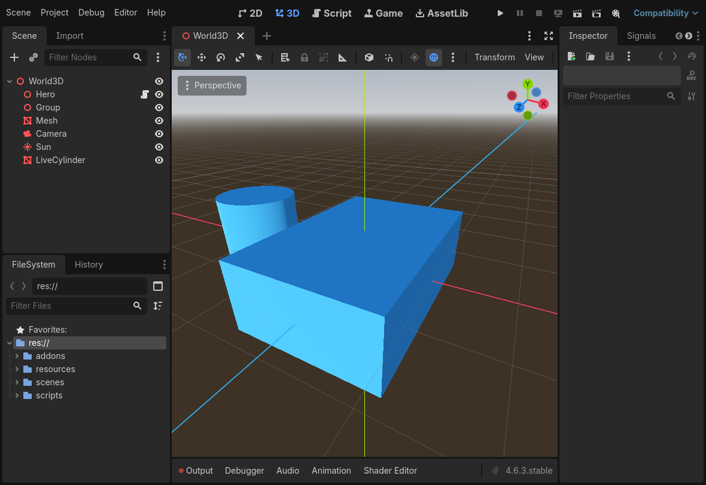

# Godot-Codex

**Let Codex AI control your running Godot editor through natural language.**

[简体中文](README.zh-CN.md) · [Download v0.2.1](downloads/godot-codex-0.2.1.zip) · [SHA-256](downloads/godot-codex-0.2.1.zip.sha256) · [Plugin documentation](godot-codex/README.md)

Godot-Codex connects an AI client to a real Godot EditorPlugin through a local stdio MCP bridge. Requests reach Godot's editor APIs to inspect and edit the open project. It includes seven Godot development skills and 26 editor tools for GDScript/C# and 2D/3D workflows.

## Features

- Inspect scenes, node hierarchies, built-in properties and signal connections.
- Create, open and save scenes; create, delete, duplicate, rename and reparent nodes.
- Change properties; create and assign native materials, meshes and shapes.
- Read, write and attach scripts; connect persistent signals to supported script methods.
- Use editor undo/redo and play/stop operations.



## Requirements

- Python 3.10 or newer; the Python tools use only the standard library.
- Godot 4.6.3 is the verified baseline. Godot 4.4.1 lacks required editor APIs.
- C# projects also require Godot .NET and a compatible .NET SDK, with a successful project build before script attachment.
- Codex or another stdio MCP client, with access to the same local project directory as Godot.

Keep Godot open and the project addon enabled. The bridge does not require an API key, network listener or cloud backend; AI client accounts and charges depend on the service you use.

## Windows quick start

Extract the download and open PowerShell in the `godot-codex` folder. Replace the example paths with your actual Python executable and trusted Godot project.

```powershell
$Python = 'C:\Python313\python.exe'
& $Python scripts/install_local.py --home $env:USERPROFILE
& $Python scripts/install_local.py --home $env:USERPROFILE --apply
```

The first command previews the installation; the second prepares it. Run the installer's printed `next_command` to register the Codex plugin. Existing installations are never overwritten by this installer.

Close the target project's editor before copying and enabling the addon:

```powershell
& $Python scripts/setup_editor_bridge.py 'D:\MyGodotProject' --enable
& $Python scripts/setup_editor_bridge.py 'D:\MyGodotProject' --apply --enable
$env:GODOT_PROJECT_PATH = 'D:\MyGodotProject'
```

Reopen the Godot project, start your AI client with the project path configured, and ask it to call `godot_status` before editing. The environment variable above applies to this PowerShell and processes launched from it. Clients launched from the Start menu need their own explicit MCP environment configuration. See the [setup guide](godot-codex/docs/EDITOR_SETUP.zh-CN.md) and [MCP configuration](godot-codex/.mcp.json). Use either the plugin's MCP connection or a separately registered connection.

## Example prompts

> Inspect the current scene hierarchy and its button signal connections.

> Create a 3D scene with a box mesh, material, light and camera in my running Godot editor. Save and run it.

> Move this Node2D to the coordinates I provided, then undo the change and verify restoration.

## Verification and scope

The public package contains verification summaries and examples. It excludes raw local logs and internal debug transcripts. Existing Windows 0.2.1 acceptance covered all 26 tools through real Godot editors and Codex app-server, including GDScript/C#, 2D/3D, save/reopen, undo/redo and failure handling. Naming and documentation changes do not imply that full editor acceptance was repeated.

This release does not automate every Godot menu or feature. macOS, a full Linux retest of 0.2.1 and other engine versions remain unverified. Use the bridge only in trusted projects you authorize AI to edit. Scene changes use revision and node identity guards; the bridge is not a sandbox for hostile project code.

[Capabilities and limits](godot-codex/docs/EDITOR_CAPABILITIES.md) · [Tool schemas](godot-codex/docs/EDITOR_API.json) · [Verification](godot-codex/docs/VERIFICATION.md)

## Source and license

[Source](godot-codex/) includes the MCP service, Godot addon, installers, seven skills, tests and examples. [MIT License](LICENSE). This independent project is not an official Godot or OpenAI product.

Report issues with your operating system, Godot version and reproduction steps. Remove personal paths and sensitive information from logs before sharing them.
